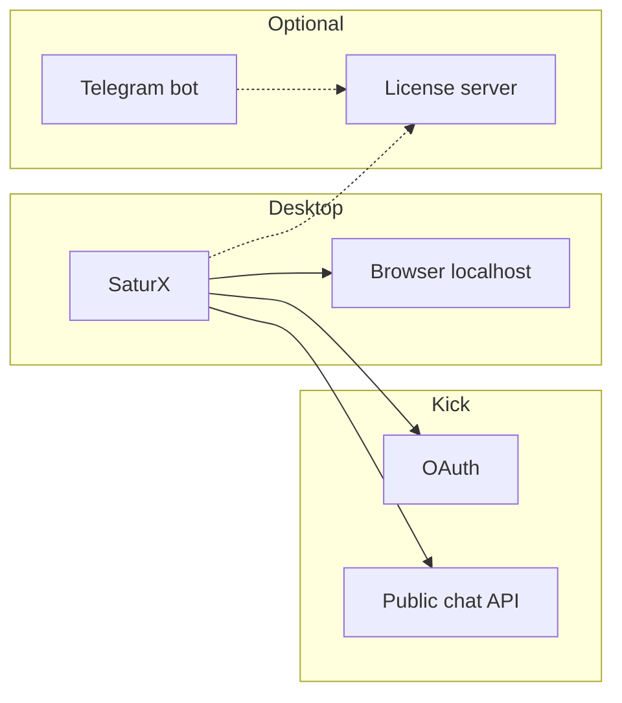

# SaturX

**Multi-account Kick dashboard:** chat, stream, OAuth accounts, presets, auto-send, optional license server, and optional viewer tools — one Go app, one browser window.

[User guide](USER-GUIDE.md) · [Contributing](CONTRIBUTING.md) · [Security](SECURITY.md) · [License](LICENSE)


---

## What it is

SaturX is a desktop application with an embedded web UI for [Kick.com](https://kick.com). Accounts are linked through **official Kick OAuth** (`channel:read`, `chat:write`). The app does not store Kick passwords or browser cookies.

Typical use:

- several Kick accounts in one window
- live chat and stream player for a chosen channel slug
- one-click presets and timed auto-send
- per-account SOCKS5 proxies
- optional license gate for distributed builds
- optional viewer-boost binary next to the main app

---

## Features

| Area | What you get |
|------|----------------|
| Accounts | OAuth add/switch, display names, SOCKS5 per account |
| Dashboard | Chat, stream embed, account list, send bar |
| Chat tools | Presets from `messages.txt`, Kick emotes, replies |
| Auto sender | Messages from `auto-sender.txt` with delay range and account rotation |
| License | Optional key activation, device binding, refresh/revoke |
| Viewer tools | Optional `viewerbot` binary started from the same UI |
| Ops | License server (Postgres + Redis), Telegram sales bot, marketing landing |

---

## Repository layout

```text
.
├── main.go / web.go / accounts.go   # desktop app + dashboard API
├── static/                          # embedded UI (HTML/CSS/JS, emotes)
├── internal/                        # runners, HTTP client, license store, viewerbot launcher
├── license-server/                  # key issue / activate / revoke API + admin UI
├── telegram-sales-bot/              # Crypto Pay checkout → license keys
├── landing/                         # Next.js marketing site
├── scripts/                         # release and local test helpers
└── USER-GUIDE.md                    # end-user setup
```



---

## Quick start (development)

**Requirements:** Go 1.24+, a Kick app at [developers.kick.com](https://developers.kick.com/).

1. Create an OAuth application. Redirect URL:

   `http://localhost:8080/oauth/callback`

   Scopes: `chat:write`, `channel:read`.

2. Copy the env template and fill in placeholders (never commit real secrets):

```bash
cp .env.example .env
```

```env
KICK_CLIENT_ID=your_client_id
KICK_CLIENT_SECRET=your_client_secret
CHANNEL_SLUG=your_channel
```

3. Run:

```bash
go test ./...
go run .
```

4. Open [http://localhost:8080](http://localhost:8080), add an account, send a message.

Local run without a license server:

```env
SKIP_LICENSE=1
```

Do not use `SKIP_LICENSE` in builds you ship to other people.

---

## Building a release

Windows:

```powershell
.\scripts\build-release.ps1
```

macOS / Linux:

```bash
./scripts/build-release.sh
```

The scripts read `LICENSE_SERVER_URL` and `LICENSE_HMAC_SECRET` from `.env` and embed them into the binary. End users only need Kick OAuth fields.

Details: [LAUNCH.md](LAUNCH.md).

---

## Optional services

| Component | Docs |
|-----------|------|
| License server | [license-server/README.md](license-server/README.md) |
| Telegram sales bot | [telegram-sales-bot/README.md](telegram-sales-bot/README.md) |
| Landing | [landing/README.md](landing/README.md) |
| Feature notes | [FEATURES.md](FEATURES.md) |

---

## Configuration files (local, gitignored)

| File | Purpose |
|------|---------|
| `.env` | OAuth client, channel slug, optional ports |
| `.kick_accounts.json` | Linked accounts and proxies |
| `.kick_proxies` | Optional proxy list (one line per account) |
| `.kick_license.dat` | Cached license payload on this machine |
| `messages.txt` | Dashboard preset lines |
| `auto-sender.txt` | Auto-sender lines |

---

## Disclaimer

You are responsible for how you use this software. Follow Kick’s terms of service, platform rules, and the law in your country. Viewer tools and multi-account chat can violate a platform’s rules if misused. The authors provide the code as-is under MIT and are not liable for bans, account loss, or other damage.

---

## Contributing

See [CONTRIBUTING.md](CONTRIBUTING.md). Keep examples generic and never commit secrets.

## License

[MIT](LICENSE) © 2026 Santoridev
